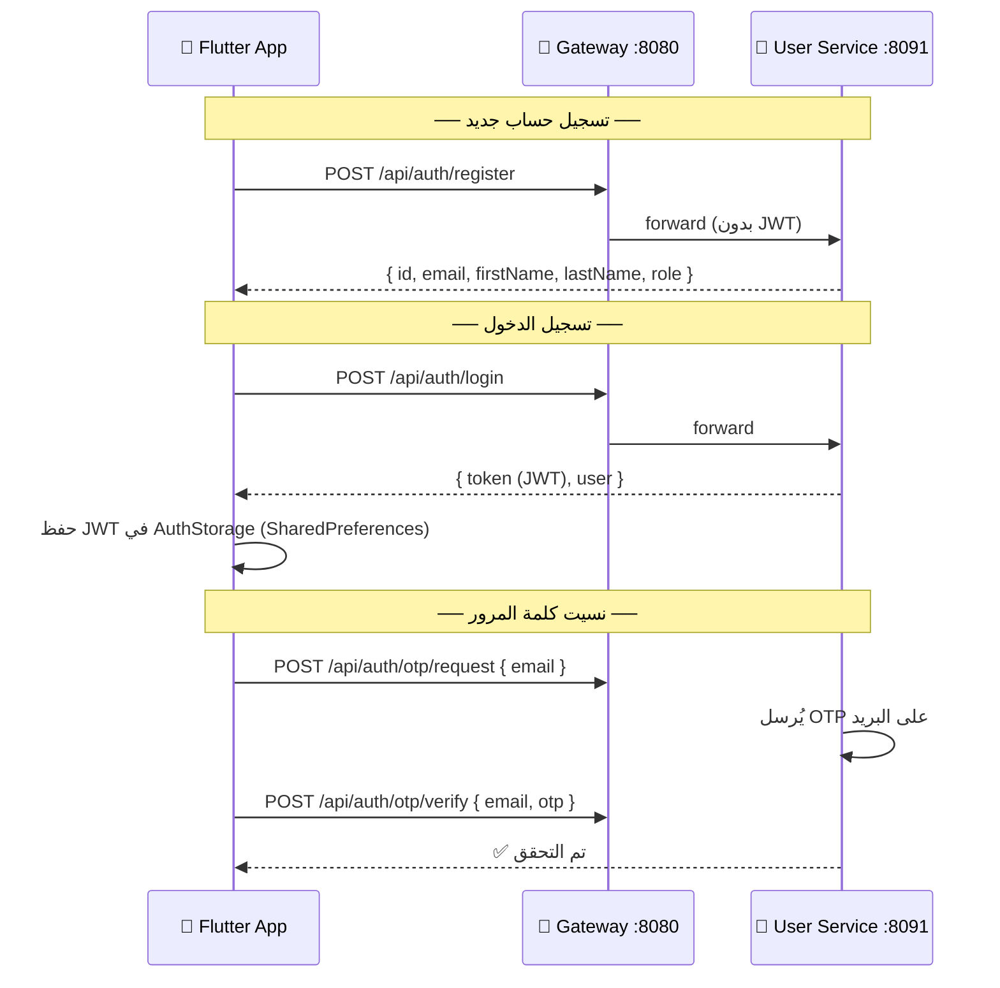
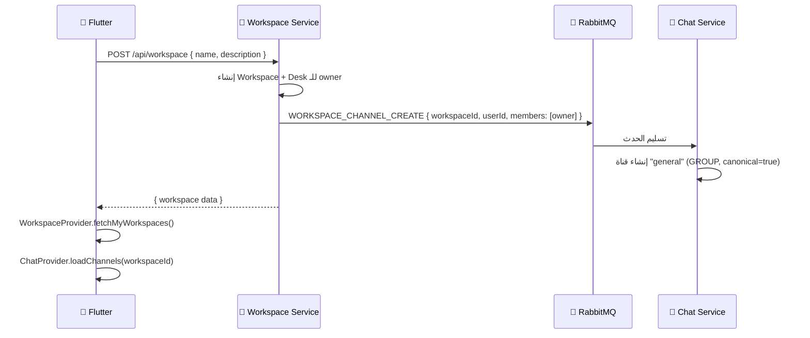
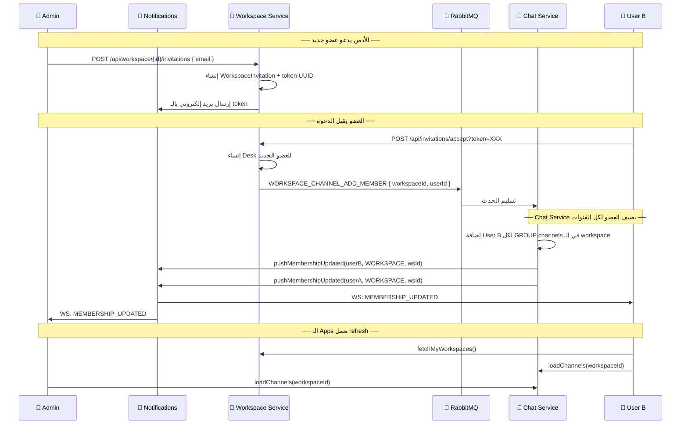
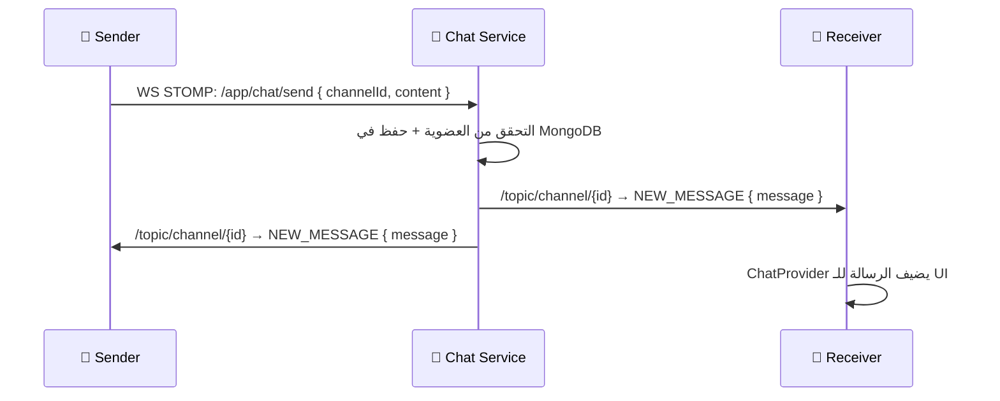
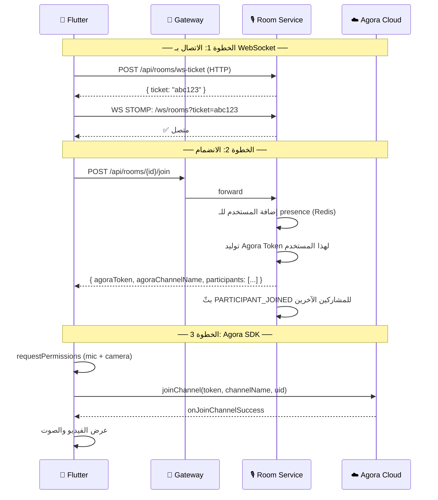
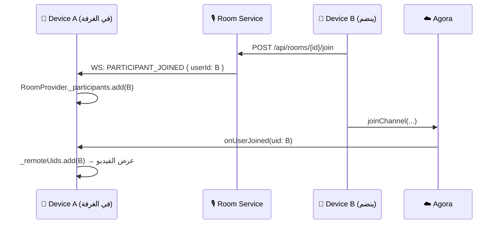
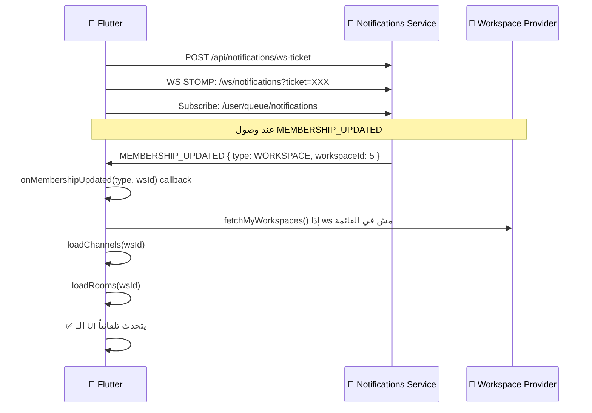
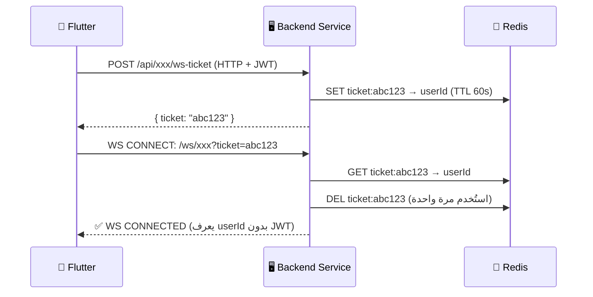
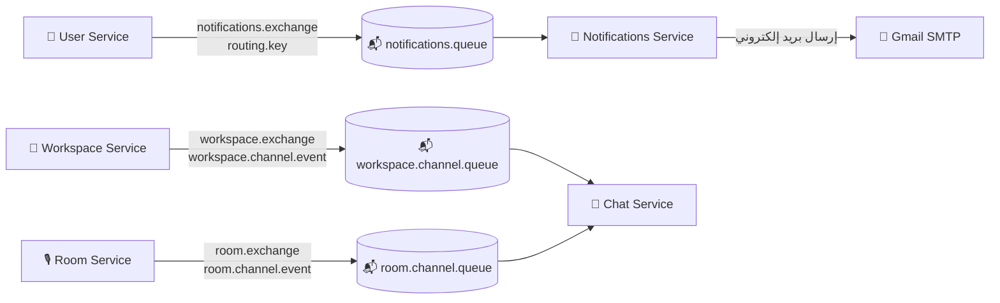

# 📱 توثيق مشروع المكتب الافتراضي (Virtual Office)
### شرح شامل للموبايل آب — الخدمات · الفيتشرز · الفلو · التحديات

---

## 🗂️ الفهرس

1. [نظرة عامة على المشروع](#1-نظرة-عامة-على-المشروع)
2. [البنية التحتية والمعمارية](#2-البنية-التحتية-والمعمارية)
3. [الخدمات الخلفية (Microservices)](#3-الخدمات-الخلفية)
4. [تطبيق الموبايل Flutter](#4-تطبيق-الموبايل-flutter)
5. [الفيتشرز من منظور الموبايل](#5-الفيتشرز-من-منظور-الموبايل)
   - [5.1 التسجيل وتسجيل الدخول](#51-التسجيل-وتسجيل-الدخول)
   - [5.2 إدارة الـ Workspace](#52-إدارة-الـ-workspace)
   - [5.3 الدعوات (Invitations)](#53-الدعوات)
   - [5.4 المحادثات (Chat)](#54-المحادثات)
   - [5.5 الغرف الصوتية/المرئية (Rooms)](#55-الغرف-الصوتيةالمرئية)
   - [5.6 الإشعارات (Notifications)](#56-الإشعارات)
   - [5.7 البروفايل وإدارة الحساب](#57-البروفايل-وإدارة-الحساب)
6. [نظام الـ WebSocket والوقت الحقيقي](#6-نظام-الـ-websocket-والوقت-الحقيقي)
7. [نظام الـ RabbitMQ (الرسائل بين الخدمات)](#7-نظام-الـ-rabbitmq)
8. [التحديات والحلول](#8-التحديات-والحلول)
9. [ملخص سريع لكل فيتشر](#9-ملخص-سريع-لكل-فيتشر)

---

## 1. نظرة عامة على المشروع

**Virtual Office** هو تطبيق موبايل يحاكي بيئة مكتب افتراضي حقيقي. الفكرة الأساسية إن الفريق يقدر يشتغل مع بعض على بُعد كأنهم جنب بعض في مكتب حقيقي:

- تنظيم فرق العمل في **Workspaces**
- التواصل عبر **قنوات محادثة نصية** (زي Slack)
- **مكالمات صوتية ومرئية** في غرف مخصصة (زي Zoom)
- **إشعارات فورية** لكل الأحداث في الوقت الحقيقي

### الـ Tech Stack

| الجانب | التقنية |
|--------|---------|
| الموبايل | Flutter (Dart) |
| الـ Backend | Java 21 + Spring Boot 3 |
| قاعدة البيانات الرئيسية | PostgreSQL (workspace) + MongoDB (chat, rooms, notifications) |
| الـ Cache | Redis |
| الرسائل بين الخدمات | RabbitMQ |
| الـ Real-time | WebSocket + STOMP |
| المكالمات | Agora RTC SDK |
| الـ State Management | Flutter Provider Pattern |

---

## 2. البنية التحتية والمعمارية

### مخطط المعمارية الكاملة

```
┌─────────────────────────────────────────────────────────────┐
│                      Flutter Mobile App                      │
└──────────────────┬──────────────────────────────────────────┘
                   │ HTTP / WebSocket
                   ▼
┌─────────────────────────────────────────────────────────────┐
│                   API Gateway  (:8080)                       │
│  • التحقق من JWT                                            │
│  • يحقن X-User-Id + X-User-Role في كل طلب                  │
│  • يوجه الطلبات للخدمة المناسبة                             │
└──┬──────┬──────┬──────┬──────────────────────────────────────┘
   │      │      │      │
   ▼      ▼      ▼      ▼
 User  Workspace Chat  Room
(:8091) (:8087) (:8084)(:8086)
           │
           │ (direct - no gateway)
           ▼
    Notifications(:8082)
```

### التوجيه (Routing) في الـ Gateway

```
/api/auth/**        ──→  user-service   :8091
/api/otp/**         ──→  user-service   :8091
/api/users/**       ──→  user-service   :8091
/api/workspace/**   ──→  workspace-service :8087
/api/chat/**        ──→  chat-service   :8084
/api/rooms/**       ──→  room-service   :8086
```

> **ملاحظة:** الـ Notifications Service (:8082) — يتصل بيه الموبايل مباشرةً بدون Gateway للـ WebSocket.

### البنية التحتية (Infrastructure)

```
┌────────────────────────────────────────────────┐
│               Docker Compose                    │
│                                                 │
│  PostgreSQL :5433  ──→ workspace-service        │
│  MongoDB    :27017 ──→ chat + room + notifications│
│  Redis      :6379  ──→ كل الخدمات (tickets + cache)│
│  RabbitMQ   :5672  ──→ الرسائل بين الخدمات     │
│  (Admin UI) :15672                              │
└────────────────────────────────────────────────┘
```

---

## 3. الخدمات الخلفية

### 3.1 User Service — :8091

**المهمة:** إدارة المستخدمين، المصادقة، وكلمات المرور.

**قاعدة البيانات:** MySQL (`virtual_office`)

#### الـ Endpoints:

| الطريقة | المسار | الوصف | مفتوح؟ |
|---------|--------|-------|--------|
| POST | `/api/auth/register` | تسجيل حساب جديد | ✅ |
| POST | `/api/auth/login` | تسجيل الدخول → يُرجع JWT | ✅ |
| POST | `/api/auth/otp/request` | طلب OTP لإعادة كلمة المرور | ✅ |
| POST | `/api/auth/otp/verify` | التحقق من الـ OTP | ✅ |
| GET | `/api/users/me` | بيانات المستخدم الحالي | 🔒 |
| PUT | `/api/users/me/password` | تغيير كلمة المرور | 🔒 |
| POST | `/api/users/me/photo` | رفع صورة شخصية | 🔒 |
| GET | `/api/users/me/photo` | جلب الصورة (bytes) | 🔒 |
| GET | `/api/users` | قائمة كل المستخدمين | 🔒 |

#### نموذج المستخدم:
```
User {
  id, firstName, lastName, email, phoneNumber,
  password (hashed), accountStatus (ACTIVE/DISABLED),
  isEmailVerified, isPhoneVerified, profilePicture (BLOB)
}
```

---

### 3.2 Workspace Service — :8087

**المهمة:** إدارة مساحات العمل والأعضاء والفرق والدعوات وخريطة المكتب.

**قاعدة البيانات:** PostgreSQL (`workspace`) مع Flyway migrations

#### أهم الـ Endpoints:

| المجموعة | الـ Endpoint | الوصف |
|---------|-------------|-------|
| Workspaces | `POST /api/workspace` | إنشاء workspace جديد |
| | `GET /api/workspace/mine` | الـ workspaces بتاعتي |
| | `GET /api/workspace/{id}` | تفاصيل workspace |
| | `PUT /api/workspace/{id}` | تعديل (ADMIN) |
| | `POST /api/workspace/{id}/rotate-invite-token` | تجديد رابط الدعوة |
| Desks | `GET /api/workspace/{id}/desks` | قائمة الأعضاء |
| | `GET /api/workspace/{id}/desks/me` | desk المستخدم الحالي |
| | `PUT /api/workspace/{id}/desks/{deskId}` | تعديل الـ desk |
| | `PATCH /api/workspace/{id}/desks/{deskId}/status` | تحديث الحالة (ACTIVE/AWAY) |
| Invitations | `POST /api/workspace/{id}/invitations` | دعوة بالبريد |
| | `GET /api/workspace/{id}/invitations` | قائمة الدعوات |
| | `POST /api/invitations/accept?token=X` | قبول الدعوة |
| Teams | `POST /api/workspace/{id}/teams` | إنشاء فريق |
| | `GET /api/workspace/{id}/teams` | قائمة الفرق |

#### الـ Roles:
- **OWNER** — أعلى صلاحية، يملك الـ workspace
- **ADMIN** — يقدر يدعو ويعدل ويحذف أعضاء
- **MEMBER** — عضو عادي

---

### 3.3 Chat Service — :8084

**المهمة:** القنوات النصية، الرسائل، الـ DMs، الـ Threads، الـ Read Receipts، الـ WebSocket.

**قاعدة البيانات:** MongoDB (`chat_service`) + Redis

#### أهم الـ Endpoints:

| المجموعة | الـ Endpoint | الوصف |
|---------|-------------|-------|
| Channels | `POST /api/chat/channels` | إنشاء قناة |
| | `GET /api/chat/channels?workspaceId=X` | قنوات الـ workspace |
| | `POST /api/chat/channels/{id}/join` | الانضمام لقناة |
| | `POST /api/chat/channels/{id}/leave` | مغادرة قناة |
| DMs | `POST /api/chat/dm` | إنشاء/جلب DM |
| | `GET /api/chat/dm` | قائمة الـ DMs |
| Messages | `POST /api/chat/channels/{id}/messages` | إرسال رسالة |
| | `GET /api/chat/channels/{id}/messages` | جلب الرسائل |
| | `PUT /api/chat/messages/{id}` | تعديل رسالة |
| | `DELETE /api/chat/messages/{id}` | حذف رسالة |
| Threads | `POST /api/chat/channels/{id}/threads` | إنشاء thread |
| | `GET /api/chat/channels/{id}/threads` | قائمة الـ threads |
| | `GET /api/chat/threads/{id}/messages` | رسائل الـ thread |
| Read | `POST /api/chat/channels/{id}/read` | تحديد آخر مقروء |
| | `GET /api/chat/channels/{id}/unread` | عدد غير المقروءة |

#### أنواع القنوات:
- **GROUP** — قناة مشتركة في workspace
- **DM** — محادثة مباشرة بين شخصين
- **ROOM** — قناة مرتبطة تلقائياً بغرفة صوتية

#### الـ WebSocket (STOMP):
```
اتصال: ws://host:8084/api/chat/connect?ticket=XXX

الاشتراكات:
  /topic/channel/{channelId}         ← رسائل جديدة/تعديل/حذف
  /topic/channel/{channelId}/typing  ← مؤشر الكتابة
  /topic/thread/{threadId}           ← رسائل الـ thread

الإرسال (من الموبايل):
  /app/chat/send    ← إرسال رسالة
  /app/chat/typing  ← مؤشر الكتابة
```

---

### 3.4 Room Service — :8086

**المهمة:** الغرف الصوتية/المرئية، إدارة المشاركين، Agora tokens، الـ Presence.

**قاعدة البيانات:** MongoDB (`room_service`) + Redis

#### أهم الـ Endpoints:

| الـ Endpoint | الوصف |
|-------------|-------|
| `POST /api/rooms` | إنشاء غرفة |
| `GET /api/rooms?workspaceId=X` | قائمة الغرف |
| `PATCH /api/rooms/{id}` | تعديل الغرفة |
| `DELETE /api/rooms/{id}` | حذف الغرفة |
| `POST /api/rooms/{id}/members` | إضافة عضو |
| `DELETE /api/rooms/{id}/members/{userId}` | إزالة عضو |
| `POST /api/rooms/{id}/join` | **الانضمام** — يُرجع Agora token + مشاركين |
| `POST /api/rooms/{id}/leave` | مغادرة الغرفة |
| `GET /api/rooms/{id}/participants` | قائمة المشاركين الحاليين |
| `POST /api/rooms/ws-ticket` | تذكرة WebSocket |

#### الـ Agora Configuration:
- **App ID:** `5db80389fc284a3a8c166979882f118d`
- **App Certificate:** موجود (يولّد tokens حقيقية)
- **اسم القناة:** `room-{roomId}`
- **مدة الـ Token:** 3600 ثانية (ساعة)

#### الـ WebSocket (STOMP):
```
اتصال: ws://host:8086/ws/rooms?ticket=XXX

الاشتراكات:
  /topic/room/{roomId}  ← أحداث الغرفة

الأحداث الواردة:
  PARTICIPANT_JOINED  ← انضم مشارك جديد
  PARTICIPANT_LEFT    ← خرج مشارك
  STATE_CHANGED       ← تغيّرت حالة مشارك (muted/camera)
  ROOM_UPDATED        ← تحديث بيانات الغرفة
  ROOM_CLOSED         ← أُغلقت الغرفة

الإرسال (من الموبايل):
  /app/room/state      ← تحديث حالتي (muted/cameraOn/screenSharing)
  /app/room/heartbeat  ← نبضة حياة كل 15 ثانية
```

---

### 3.5 Notifications Service — :8082

**المهمة:** الإشعارات الفورية عبر WebSocket، صندوق الوارد، البريد الإلكتروني.

**قاعدة البيانات:** MongoDB (`notifications`) + Redis

#### أهم الـ Endpoints:

| الـ Endpoint | الوصف |
|-------------|-------|
| `GET /api/notifications` | قائمة الإشعارات |
| `GET /api/notifications/unread-count` | عدد غير المقروءة |
| `PATCH /api/notifications/{id}/read` | تحديد كمقروء |
| `PATCH /api/notifications/read-all` | تحديد الكل كمقروء |
| `DELETE /api/notifications/{id}` | حذف إشعار |
| `POST /api/notifications/ws-ticket` | تذكرة WebSocket |

#### الـ WebSocket (STOMP):
```
اتصال: ws://host:8082/ws/notifications?ticket=XXX

الاشتراك:
  /user/queue/notifications  ← إشعارات شخصية

الأحداث الواردة:
  NEW_NOTIFICATION    ← إشعار جديد في الصندوق
  MEMBERSHIP_UPDATED  ← تغيّر العضوية (workspace/channel/room)
```

> **ملاحظة مهمة:** الـ `MEMBERSHIP_UPDATED` هو الحدث الأساسي اللي بيخلي الموبايل يعمل refresh تلقائي عند انضمام عضو جديد للـ workspace.

---

## 4. تطبيق الموبايل Flutter

### 4.1 هيكل التطبيق

```
lib/
├── core/
│   ├── constants/    (API URLs)
│   ├── network/      (ApiClient - HTTP مع JWT)
│   └── storage/      (AuthStorage - token محلي)
├── models/           (بيانات: User, Channel, Message, Room...)
├── providers/        (State Management)
│   ├── auth_provider.dart
│   ├── chat_provider.dart
│   ├── room_provider.dart
│   ├── workspace_provider.dart
│   └── notification_provider.dart
├── services/         (HTTP calls + WebSocket)
│   ├── auth_service.dart
│   ├── channel_service.dart
│   ├── message_service.dart
│   ├── room_service.dart
│   ├── workspace_service.dart
│   ├── notification_service.dart
│   ├── websocket_service.dart     (Chat WS)
│   ├── room_ws_service.dart       (Room WS)
│   └── notification_ws_service.dart
└── screens/
    ├── auth/         (Login, Register, ForgotPassword, VerifyOTP)
    ├── home/         (HomeScreen - Navigation)
    ├── chat/         (Channels, ChatScreen, DMs, Threads)
    ├── rooms/        (RoomsList, CreateRoom, RoomCallScreen)
    ├── workspace/    (WorkspaceList, Detail, MyDesk, SkyDesk)
    ├── notifications/ (NotificationsScreen)
    └── profile/      (ProfileScreen)
```

### 4.2 إدارة الحالة (State Management)

```
┌────────────────────────────────────────────────────────┐
│                    Provider Tree                        │
│                                                         │
│  AuthProvider      ← من هو المستخدم؟ مسجّل دخول؟      │
│  WorkspaceProvider ← أي workspaces لديه؟ desk؟ فرق؟  │
│  ChatProvider      ← قنوات، رسائل، DMs، unread counts │
│  RoomProvider      ← غرف، مشاركين، Agora token        │
│  NotificationProvider ← إشعارات، unread count         │
└────────────────────────────────────────────────────────┘
```

### 4.3 الشاشات الرئيسية

```
SplashScreen
    │
    ├── (غير مسجّل) ──→ LoginScreen / RegisterScreen
    │                           │
    │                    ForgotPasswordScreen
    │                    VerifyOtpScreen
    │
    └── (مسجّل) ──→ HomeScreen
                        │
                        ├── Tab 0: ChannelsScreen
                        │         └──→ ChatScreen
                        │               └──→ ThreadsScreen
                        │                     └──→ ThreadChatScreen
                        │
                        ├── Tab 1: DmsScreen
                        │         └──→ ChatScreen (DM)
                        │
                        ├── Tab 2: RoomsScreen
                        │         ├──→ CreateRoomScreen
                        │         └──→ RoomCallScreen (Agora)
                        │
                        ├── Tab 3: WorkspaceListScreen
                        │         └──→ WorkspaceDetailScreen
                        │               ├──→ MyDeskScreen
                        │               └──→ SkyDeskScreen
                        │
                        ├── Tab 4: NotificationsScreen
                        │
                        └── Tab 5: ProfileScreen
```

---

## 5. الفيتشرز من منظور الموبايل

---

### 5.1 التسجيل وتسجيل الدخول

#### الفلو الكامل:



#### ما الذي يحدث في الخلفية؟
- الـ JWT يحتوي على `userId` و`role` داخله (مشفّر)
- كل طلب بعد تسجيل الدخول يحمل `Authorization: Bearer {JWT}`
- الـ Gateway يفكّ الـ JWT ويحقن `X-User-Id` و`X-User-Role` في كل طلب للخدمات الداخلية
- الخدمات الداخلية لا تتحقق من الـ JWT — تثق بالـ Gateway

---

### 5.2 إدارة الـ Workspace

#### فلو إنشاء Workspace جديد:



#### الـ Desk (مقعد العمل):
كل عضو في الـ workspace عنده **Desk** يمثّل وجوده:
- `status` — ACTIVE / AWAY / BUSY / DO_NOT_DISTURB / OFFLINE
- `positionX/Y` — موقعه على خريطة المكتب الافتراضية
- `avatarCharacter` — الأفاتار (ADAM/ASH/LUCY/NANCY)
- `links / widgets` — روابط وأدوات شخصية

---

### 5.3 الدعوات

#### الفلو الكامل (من الدعوة للانضمام):



> **التحدي:** User B بعد قبول الدعوة كان بيُضاف فقط للـ "general" channel — أي قنوات إضافية أنشأها الأدمن كانت بيحصل فيها 403.  
> **الحل:** تعديل `WorkspaceChannelListener.addMember()` لتضيف العضو لـ **كل** القنوات من نوع GROUP في الـ workspace.

---

### 5.4 المحادثات

#### أنواع المحادثات:
| النوع | الوصف | الـ DB key |
|-------|-------|------------|
| GROUP | قناة مشتركة في workspace | `type = GROUP` |
| DM | محادثة مباشرة بين شخصين | `type = DM`, `dmKey = "min(a,b)-max(a,b)"` |
| ROOM | قناة مرتبطة بغرفة صوتية | `type = ROOM` |

#### فلو إرسال رسالة (Real-time):



#### الـ Read Receipts:
- عند فتح شاشة Chat → `POST /api/chat/channels/{id}/read` بـ `lastReadMessageId`
- الـ unread count يُحسب من MongoDB: رسائل بعد `lastReadAt` للمستخدم

#### مؤشر الكتابة (Typing):
```
User يكتب → WS: /app/chat/typing { channelId, typing: true }
                → يُبثّ على /topic/channel/{id}/typing
                → الـ UI يظهر "أحمد يكتب..."
```

#### الـ Threads:
- كل رسالة يمكن تحويلها لـ thread
- Thread له رسائله المستقلة ومقروءاته المستقلة
- الـ WebSocket: `/topic/thread/{threadId}`

---

### 5.5 الغرف الصوتية/المرئية

#### أهم المفاهيم:
- كل غرفة لها **اسم قناة Agora** = `room-{roomId}`
- الـ Backend يولّد **Agora Token** خاص بكل مستخدم عند الانضمام (مدة ساعة)
- الـ WebSocket للغرف منفصل تماماً عن الـ Chat WebSocket

#### فلو الانضمام لغرفة:



#### فلو اكتشاف المشاركين الجدد:



#### هيكل RoomCallScreen:
```
initState() {
    initWebSocket()     ← اتصال STOMP (ينتظر حتى يكتمل ✅)
    joinRoom(roomId)    ← HTTP + subscribe للـ WS topic
    _initAgora(...)     ← تهيئة SDK + طلب permissions + joinChannel
}

_initAgora(channelName, token, uid) {
    Permission.microphone + Permission.camera
    createAgoraRtcEngine()
    initialize(appId)
    enableVideo()
    registerEventHandler(
        onJoinChannelSuccess → _joined = true
        onUserJoined         → _remoteUids.add(uid)
        onUserOffline        → _remoteUids.remove(uid)
        onError              → عرض رسالة الخطأ
    )
    joinChannel(token, channelName, uid)  ← يستخدم الـ token الحقيقي من Backend
}
```

---

### 5.6 الإشعارات

#### أنواع الإشعارات:
- **NEW_NOTIFICATION** — إشعار جديد في الصندوق (دعوة workspace، رسالة جديدة، إلخ)
- **MEMBERSHIP_UPDATED** — تغيّر عضوية (انضممت لـ workspace جديد، أُضفت لقناة)

#### فلو استقبال الإشعار:



#### الـ Polling Backup:
- Timer كل 10 ثوانٍ في `HomeScreen` يعمل `silentRefresh()`
- بيعمل refresh للـ channels والـ rooms بدون loading indicator
- هذا بيعوّض في حال انقطع الـ WebSocket مؤقتاً

---

### 5.7 البروفايل وإدارة الحساب

**ما يقدر المستخدم يعمله:**

| الفعل | الـ Endpoint |
|-------|-------------|
| عرض بياناته | `GET /api/users/me` |
| تغيير كلمة المرور | `PUT /api/users/me/password` |
| رفع صورة شخصية | `POST /api/users/me/photo` (multipart) |
| تعديل بيانات الـ desk | `PUT /api/workspace/{id}/desks/{deskId}` |
| تغيير حالته (ACTIVE/AWAY) | `PATCH .../desks/{deskId}/status` |
| مغادرة workspace | حذف الـ desk |

---

## 6. نظام الـ WebSocket والوقت الحقيقي

### نظام الـ Ticket (One-Time Authentication)



> **لماذا Ticket وليس JWT في الـ URL؟**  
> لأن الـ URL قد يُسجَّل في الـ server logs وهذا خطر أمني. الـ ticket مؤقت (60 ثانية) وبيُحذف بعد أول استخدام.

### الـ 3 WebSocket Connections في التطبيق

```
┌──────────────────────────────────────────────────────────┐
│                    Flutter App                            │
│                                                           │
│  WS1: Chat WebSocket (:8084)                             │
│       └── يبدأ عند HomeScreen.initState()                │
│       └── يُعيد الاتصال بعد 5 ثوانٍ عند الانقطاع        │
│                                                           │
│  WS2: Notifications WebSocket (:8082)                    │
│       └── يبدأ مع Chat WS في نفس الوقت                  │
│       └── يستمع: /user/queue/notifications               │
│                                                           │
│  WS3: Room WebSocket (:8086)                             │
│       └── يبدأ فقط عند دخول RoomCallScreen              │
│       └── ينتهي عند الخروج من الغرفة                    │
└──────────────────────────────────────────────────────────┘
```

---

## 7. نظام الـ RabbitMQ

### تدفق الرسائل بين الخدمات



### أحداث كل خدمة

#### Workspace → Chat:
| الحدث | متى يُرسَل | ماذا يعمل Chat Service |
|-------|----------|----------------------|
| `WORKSPACE_CHANNEL_CREATE` | عند إنشاء workspace | ينشئ قناة "general" |
| `WORKSPACE_CHANNEL_ADD_MEMBER` | عند قبول دعوة | يضيف العضو لكل GROUP channels + يُرسل MEMBERSHIP_UPDATED |
| `WORKSPACE_CHANNEL_REMOVE_MEMBER` | عند إزالة عضو | يزيل العضو من الـ canonical channel |

#### Room → Chat:
| الحدث | متى يُرسَل | ماذا يعمل Chat Service |
|-------|----------|----------------------|
| `ROOM_CHANNEL_CREATE` | عند إنشاء غرفة | ينشئ قناة ROOM مرتبطة |
| `ROOM_CHANNEL_DELETE` | عند حذف غرفة | يحذف القناة المرتبطة |

---

## 8. التحديات والحلول

### التحدي 1: مشكلة الـ WebSocket Authentication

**المشكلة:** الـ WebSocket connections لا تدعم إرسال `Authorization: Bearer` header بشكل موثوق في Flutter (خاصةً على iOS/Android).

**الحل:** نظام **One-Time Ticket** مبني على Redis:
1. الموبايل يطلب ticket عبر HTTP (محمي بـ JWT)
2. Backend يحفظ ticket→userId في Redis بـ TTL 60 ثانية
3. الموبايل يمرر الـ ticket في الـ URL: `?ticket=abc123`
4. Backend يستبدل الـ ticket بـ userId ويحذفه من Redis فوراً

---

### التحدي 2: مشكلة Agora VideoViewController

**المشكلة:** تطبيق الموبايل كان يستخدم channel name ثابت (`flutter_ring`) في `joinChannel` لكن `_channelId` كان يُعيَّن بـ channel name من الـ Backend (`room-686a...`). عند انضمام Device B، الـ `VideoViewController.remote` كان يُنشَأ بـ channelId خاطئ → crash في الـ Agora native SDK.

```
قبل الإصلاح:
  _channelId = 'room-686a...'  (من Backend)
  joinChannel(channelId: 'flutter_ring')  ← مختلف!
  VideoViewController.remote(channelId: 'room-686a...')  ← CRASH!

بعد الإصلاح:
  _channelId = channelName  (من Backend)
  joinChannel(token: realToken, channelId: channelName)  ← متطابق ✅
```

**الحل:** استخدام الـ token الحقيقي والـ channel name الحقيقي من الـ Backend في `joinChannel`.

---

### التحدي 3: Race Condition في STOMP Subscription

**المشكلة:** `RoomWsService.subscribeToRoom()` كانت تُستدعى مباشرةً بعد `init()` لكن الـ `init()` يُشغّل الاتصال في الخلفية ويرجع فوراً بدون انتظار. نتيجة: `subscribeToRoom()` تجد `_isConnected = false` وتُغلق بصمت.

```
قبل الإصلاح:
  await init()         ← activate() يبدأ لكن لا ينتظر onConnect
  subscribeToRoom()   ← _isConnected = false → يخرج بدون اشتراك!

بعد الإصلاح:
  await init()         ← ينتظر Completer يكتمل في onConnect ✅
  subscribeToRoom()   ← _isConnected = true → يشترك بنجاح ✅
```

**الحل:** إضافة `Completer<void>` في `init()` يكتمل عند `onConnect` مع timeout 10 ثوانٍ.

---

### التحدي 4: User B لا تظهر له الرسائل

**المشكلة:** عند قبول الدعوة، `WorkspaceChannelListener.addMember()` كانت تضيف User B فقط للـ "canonical" channel (general). أي قنوات أنشأها الأدمن يدوياً (GROUP channels) لم يُضاف إليها User B → الـ backend يرفض الاشتراك والإرسال بـ 403.

**الحل:** تعديل `addMember()` لتستخدم `findGroupChannelsByWorkspaceId()` وتضيف User B لـ **كل** قنوات نوع GROUP في الـ workspace.

---

### التحدي 5: الـ App لا يتحدث بعد قبول الدعوة

**المشكلة:** User B بعد قبول الدعوة كان يضطر لغلق وإعادة فتح التطبيق لرؤية الـ workspace الجديد. لم تكن هناك آلية لإعلام الـ app بالتحديث.

**الحل:**
1. Chat Service يُرسل `MEMBERSHIP_UPDATED` لـ User B وكل الأعضاء عبر `NotificationsPushClient`
2. `NotificationProvider.onMembershipUpdated` callback في `HomeScreen` يُشغّل `fetchMyWorkspaces()` ثم `loadChannels()` تلقائياً
3. إضافة منطق: إذا الـ workspace مش موجود في القائمة بعد → `fetchMyWorkspaces()` أولاً ثم refresh

---

### التحدي 6: dispose() بدون await في Agora

**المشكلة:** `dispose()` كان يستدعي `_engine?.leaveChannel()` و`_engine?.release()` بدون `await` وبدون حماية ضد الاستدعاء المزدوج. إذا `_leave()` استُدعي قبلها كان `_engine` لا يزال غير null.

**الحل:** تعديل `dispose()` لتُعيَّن `_engine = null` أولاً ثم تستدعي release على المرجع القديم:
```dart
final engine = _engine;
_engine = null;  // ← منع الاستدعاء المزدوج
engine?.leaveChannel();
engine?.release();
```

---

## 9. ملخص سريع لكل فيتشر

| الفيتشر | الـ Services المعنية | الـ Real-time | التقنية الأساسية |
|--------|---------------------|-------------|----------------|
| تسجيل الحساب | User Service | ❌ | JWT + BCrypt |
| إنشاء Workspace | Workspace + Chat | ❌ (ثم WS للـ refresh) | RabbitMQ event |
| الدعوات | Workspace + Chat + Notifications | ✅ MEMBERSHIP_UPDATED | RabbitMQ + WS Push |
| المحادثات النصية | Chat Service | ✅ STOMP WebSocket | MongoDB + STOMP |
| الـ DMs | Chat Service | ✅ STOMP WebSocket | dmKey unique index |
| الـ Threads | Chat Service | ✅ STOMP WebSocket | MongoDB sub-collection |
| الغرف الصوتية | Room Service + Agora | ✅ STOMP + Agora RTC | Agora SDK + STOMP |
| الإشعارات | Notifications Service | ✅ STOMP WebSocket | MongoDB + Redis + WS |
| البروفايل | User + Workspace | ❌ | BLOB storage |

---

## الملاحق

### أهم الـ Ports

| الخدمة | المنفذ |
|--------|--------|
| API Gateway | **8080** (نقطة الدخول الوحيدة) |
| User Service | 8091 |
| Workspace Service | 8087 |
| Chat Service | 8084 |
| Room Service | 8086 |
| Notifications Service | 8082 |
| PostgreSQL | 5433 |
| MongoDB | 27017 |
| Redis | 6379 |
| RabbitMQ | 5672 (Admin: 15672) |

### الـ JWT Structure
```json
{
  "sub": "user@email.com",
  "userId": 16,
  "role": "USER",
  "iat": 1234567890,
  "exp": 1234567890
}
```

### الـ WebSocket Ticket Flow
```
Client → POST /api/{service}/ws-ticket  ← (يحتاج JWT)
Backend → Redis: SET ticket:{uuid} = userId (TTL 60s)
Backend ← { ticket: "uuid-xxx" }
Client → WS: ws://host/ws/service?ticket=uuid-xxx
Backend → Redis: GET + DEL ticket:{uuid}
Backend ← Connected (userId معروف)
```

---

*آخر تحديث: يوليو 2026*
